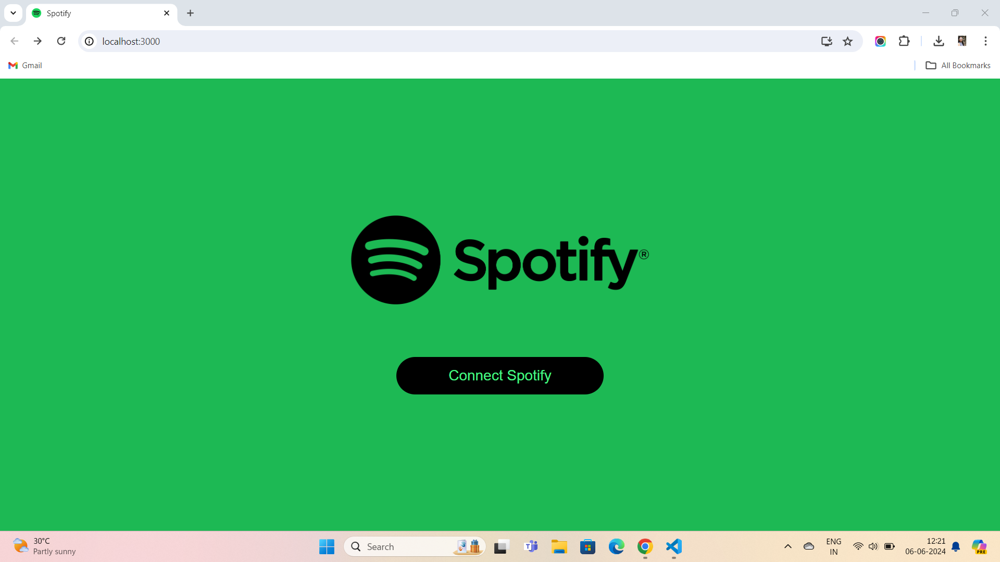
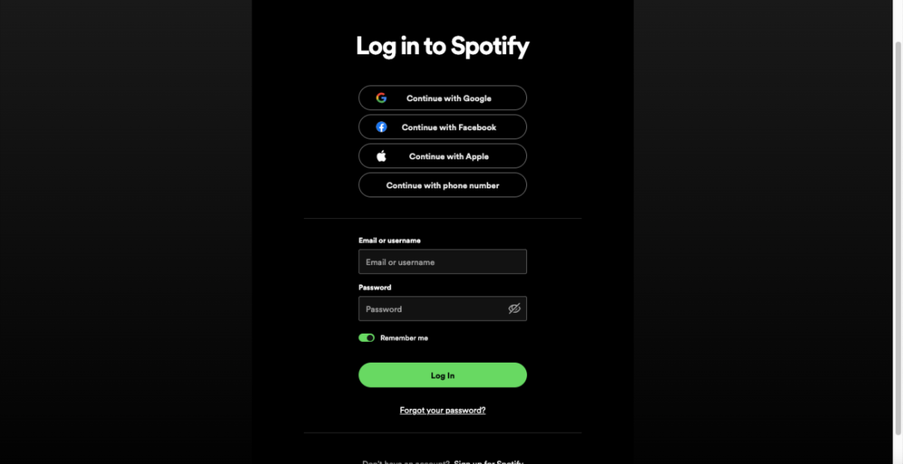
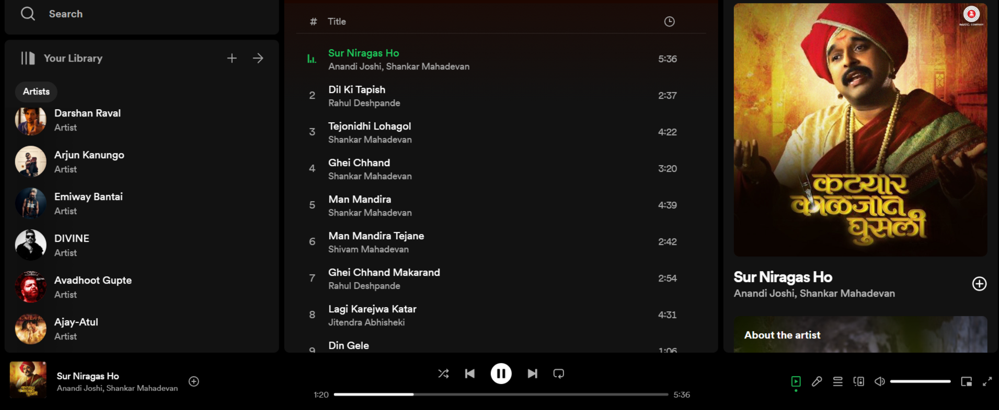

# Spotify Clone

# Overview :    
• This web application mimics the core features and functionalities of the popular music streaming service Spotify    
• This project aims to provide users with an engaging and seamless music listening experience    
• The application will allow users to search for songs, play music, create and manage playlists, and access their personal music library    

# Key Features :
• User Authentication    
• Music Player    
• Search Functionality    
• Playlists    
• User Library    
• Responsive Design   

# Screenshots

